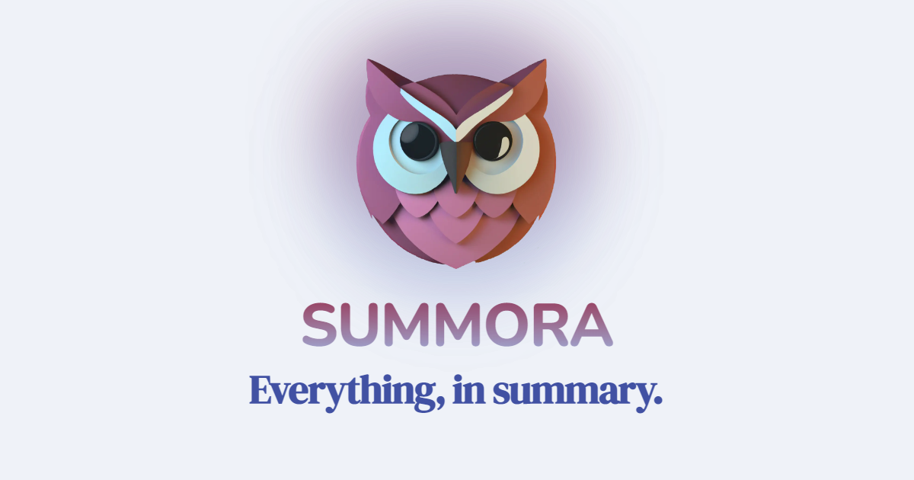

# Summora

## Everything, in summary

Platform for user-generated articles on any topic.

https://www.summora.com

### Built with

- Next.js
- tRPC
- Prisma
- AWS S3
- Tailwind CSS

### Code tour

Some interesting parts of the codebase:

- [APIs](https://github.com/bennettdams/summora/tree/main/src/server/routers)
- Image upload
  - [Server](https://github.com/bennettdams/summora/blob/main/src/server/cloud-storage.ts)
  - [Client](https://github.com/bennettdams/summora/blob/main/src/services/cloud-service.ts)
- [Form components](https://github.com/bennettdams/summora/blob/main/src/components/form.tsx)
- [Single post page](https://github.com/bennettdams/summora/blob/main/src/components/pages/post/PostPage.tsx)
- [Date formatting](https://github.com/bennettdams/summora/blob/main/src/util/date-time.ts)
